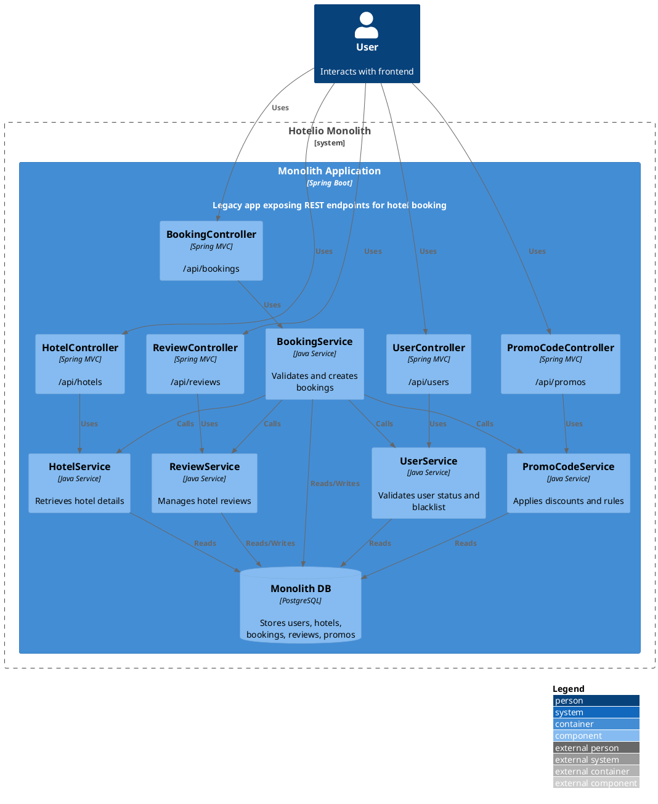
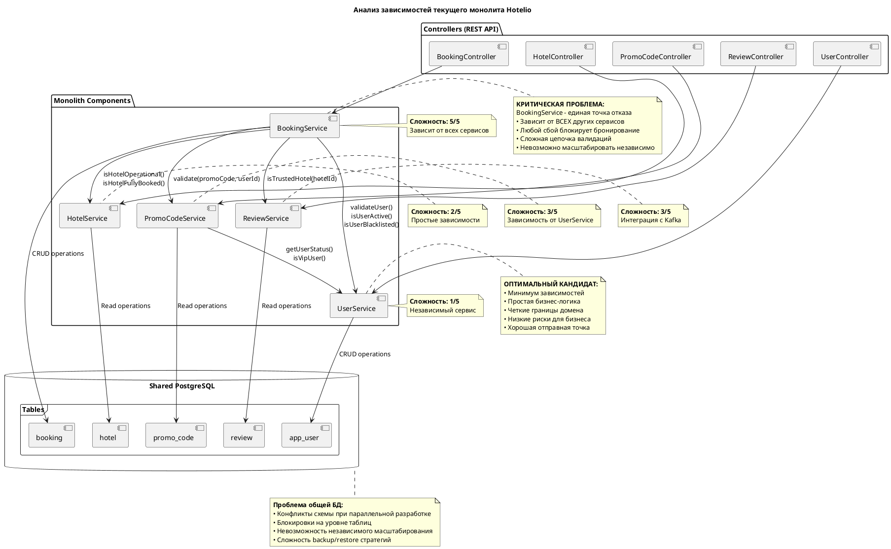
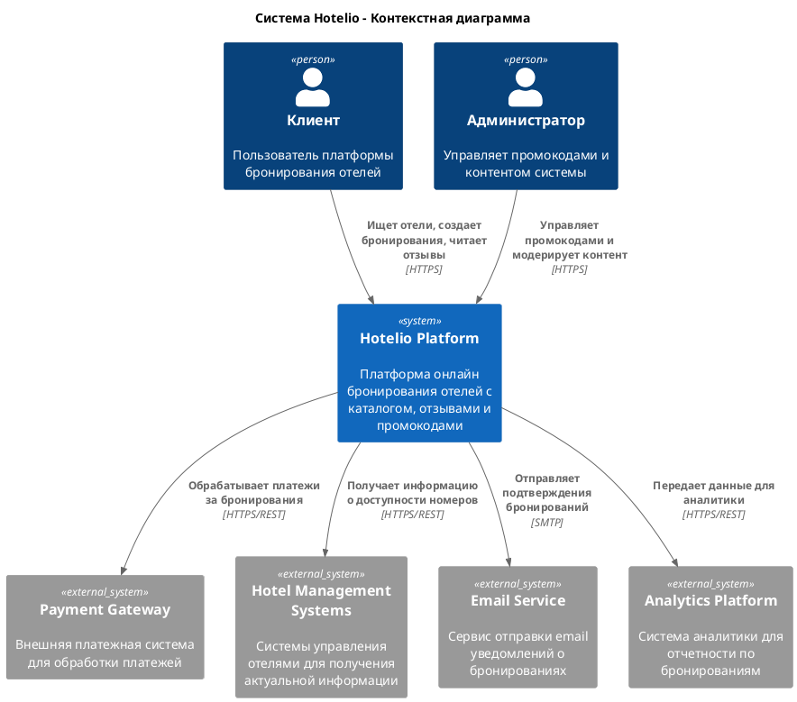
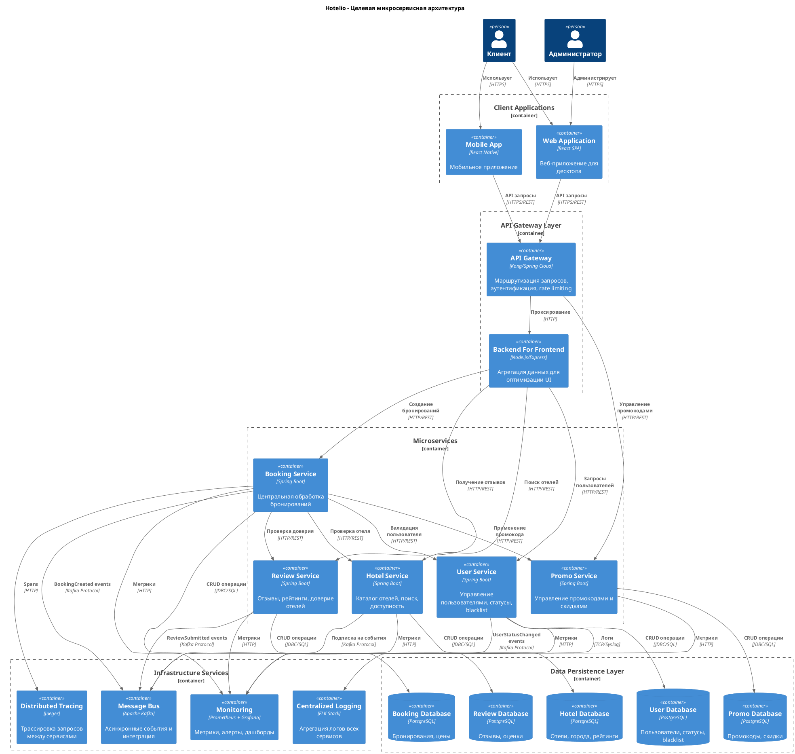
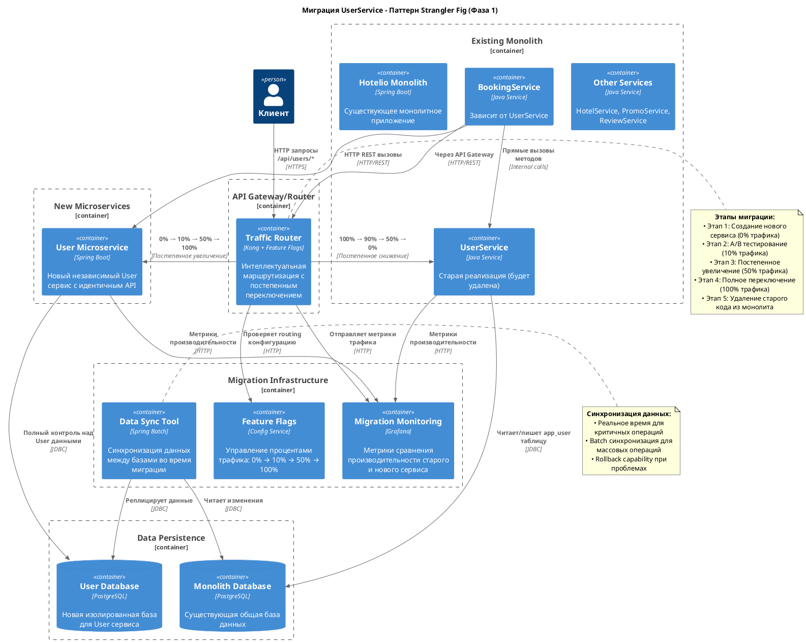

# ADR: Миграция от монолита к микросервисной архитектуре

### Название задачи
Поэтапная миграция монолитного приложения Hotelio к микросервисной архитектуре с применением паттерна Strangler Fig

### Автор:
Rinat Muhamedgaliev

### Дата:
26.08.2025

### Функциональные требования
|**№**|**Действующие лица или системы**|**Use Case**|**Описание**|
|:-:|:-|:-|:-|
|1|Пользователь|Поиск отелей|Клиент вводит город, система возвращает список доступных отелей с рейтингами и ценами. Поддержка фильтрации по топ-рейтингу|
|2|Пользователь|Создание бронирования|Клиент выбирает отель, вводит промокод (опционально). Система валидирует пользователя, отель, промокод, рассчитывает финальную цену и сохраняет бронирование|
|3|Пользователь|Просмотр отзывов|Клиент запрашивает отзывы о конкретном отеле для принятия решения о бронировании|
|4|Система|Валидация бронирования|При создании бронирования система проверяет: активность пользователя, отсутствие в blacklist, операционность отеля, доступность номеров, доверие отеля по отзывам|
|5|Администратор|Управление промокодами|Создание промокодов с настройкой скидки, срока действия, ограничений по VIP-статусу пользователей|

### Нефункциональные требования
|**№**|**Требование**|
|:-:|:-|
|1|**Масштабируемость**: Независимое масштабирование компонентов под пиковые нагрузки бронирования|
|2|**Отказоустойчивость**: Graceful degradation - сбой ReviewService не должен блокировать бронирование|
|3|**Время разработки**: Сокращение time-to-market новых фич|
|4|**Производительность**: Время отклика API для критичных операций|
|5|**Доступность**: Высокий uptime для критичных сервисов|
|6|**Совместимость**: Сохранение существующих API контрактов во время миграции|

### Оригинальная архитектура

#### Анализ зависимостей

### Решение

#### Контекстная диаграмма

#### Контейнерная диаграмма

**Анализ текущих проблем:**

BookingService является центральной точкой отказа с зависимостями от всех других сервисов. При анализе кода выявлено:
- BookingService.createBooking() последовательно вызывает validateUser(), validateHotel(), reviewService.isTrustedHotel(), promoCodeService.validate()
- Все сервисы используют общую PostgreSQL базу данных с потенциальными блокировками
- Отсутствие изоляции ошибок - сбой ReviewService полностью блокирует бронирование
- Невозможность независимого масштабирования компонентов

**Целевая архитектура:**

Микросервисная архитектура с независимыми сервисами:
- User Service: управление пользователями и их статусами
- Hotel Service: каталог отелей и проверка доступности
- Booking Service: обработка бронирований (остается центральным)
- Promo Service: управление промокодами и скидками
- Review Service: отзывы и рейтинги отелей

**Техническое решение:**
- API Gateway для маршрутизации и аутентификации
- Отдельные PostgreSQL БД для каждого сервиса
- Kafka для асинхронных событий
- Мониторинг и distributed tracing

**План миграции - паттерн Strangler Fig:**

**Фаза 1: UserService → User Microservice**

Обоснование выбора UserService:
- Минимальные внешние зависимости (не вызывает другие сервисы)
- Простая бизнес-логика (CRUD + статусные проверки)
- Четкие границы предметной области
- Низкие риски для критичной функциональности
- Обучающий эффект для команды

Этапы:
1. Создание User Microservice с идентичным API
2. Настройка отдельной User DB с синхронизацией данных
3. Внедрение feature flag для постепенного переключения трафика
4. Обновление вызовов в монолите на HTTP REST вместо прямых методов
5. Удаление UserService кода из монолита

**Последующие фазы:**
- Фаза 2: HotelService
- Фаза 3: ReviewService с внедрением Kafka
- Фаза 4: PromoService
- Фаза 5: BookingService - финальный рефакторинг

### Альтернативы

**Альтернатива 1: Big Bang Migration**
Полная миграция всех компонентов одновременно. Отклонена из-за высоких рисков простоя системы, невозможности отката и необходимости остановки разработки новых функций.

**Альтернатива 2: Database-First Decomposition**
Сначала разделение общей БД, затем сервисы. Отклонена из-за сложности поддержания консистентности данных и рисков производительности от distributed transactions.

**Альтернатива 3: Начать с BookingService**
Миграция самого критичного компонента первым. Отклонена из-за максимальной сложности, высокой вероятности неудачи и отсутствия опыта команды с микросервисами.

### Недостатки, ограничения, риски

**Недостатки:**
- Дублирование кода и логики во время переходного периода
- Увеличение операционной сложности мониторинга множественных сервисов
- Network latency для межсервисных вызовов
- Необходимость освоения новых технологий команде

**Ограничения:**
- Ограниченные ресурсы команды влияют на скорость параллельной разработки
- Отсутствие comprehensive test coverage в монолите увеличивает риски
- Legacy зависимости могут содержать скрытые связи не отраженные в коде

**Риски и митigation:**
- **Падение производительности**: Extensive load testing, внедрение circuit breakers
- **Потеря данных при миграции БД**: Comprehensive backup strategy, детальные rollback планы
- **Превышение timeline**: Поэтапный подход с возможностью отката к монолиту
- **Debugging complexity**: Внедрение distributed tracing, centralized logging
- **Team expertise gap**: Training программа, привлечение консультантов

**Критерии успеха первой фазы:**
- User Service обрабатывает весь пользовательский трафик без деградации
- Соответствие требованиям производительности
- Zero downtime при переключении трафика
- Полное удаление UserService кода из монолита
- Настроенные метрики, алерты и мониторинг