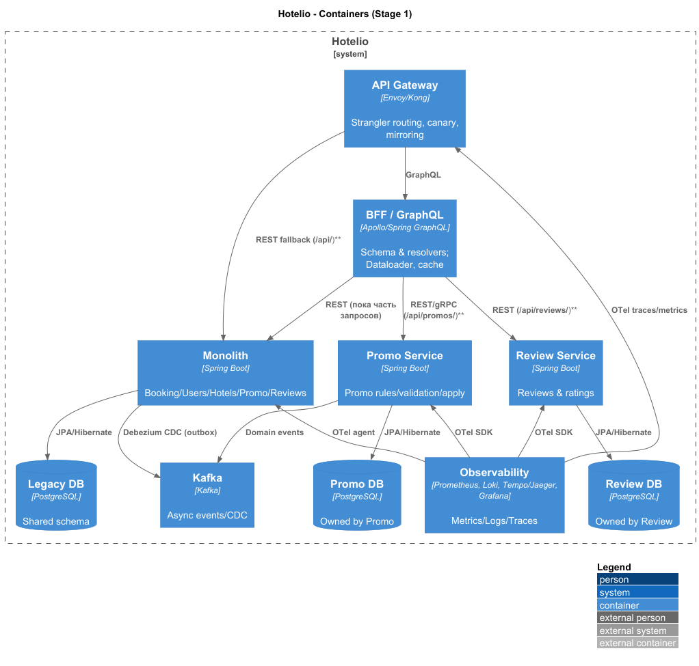
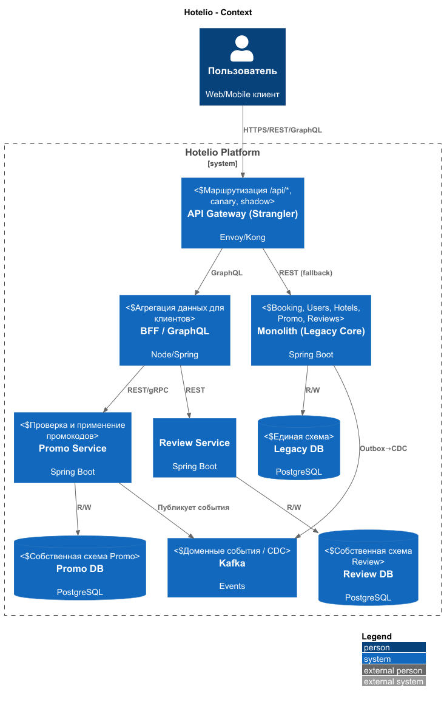

### **Название задачи: **
Hotelio — миграция от Java-монолита к микросервисам (этап 1, Strangler Fig)
### **Автор:**
Кожанов В.ВЮ
### **Дата:**
2025-11-09
### **Функциональные требования**

| **№** | **Действующие лица или системы** | **Use Case**              | **Описание (шаги высокого уровня)**                                                                                                                                 |
| :---: | :------------------------------- | :------------------------ | :------------------------------------------------------------------------------------------------------------------------------------------------------------------ |
|   1   | Пользователь                     | Поиск отеля               | Ввести фильтры → запрос в каталог отелей → сортировка/рейтинг → выдача списка с пагинацией.                                                                         |
|   2   | Пользователь                     | Создание бронирования     | Ввод параметров (пользователь, отель, даты) → валидации (user status, промокод опционально, доступность отеля) → расчёт цены/скидки → запись брони → подтверждение. |
|   3   | Пользователь/Промо               | Применение промокода      | Проверить валидность и применимость к пользователю/бронированию → рассчитать скидку → зафиксировать применение.                                                     |
|   4   | Пользователь/Отзывы              | Добавление/чтение отзывов | Создать отзыв (авторизованным пользователем) → обновить/агрегировать рейтинг → чтение отзывов по отелю.                                                             |
|   5   | Внешние каналы                   | Актуализация каталога     | Импорт/синхронизация данных об отелях и ценах от партнёров → обновление каталога.                                                                                   |
### **Нефункциональные требования**

| **№** | **Требование**                                                                                                              |
| :---: | :-------------------------------------------------------------------------------------------------------------------------- |
|   N1  | Масштабируемость горячих путей (поиск ≥ 2k RPS, бронирование ≥ 300 RPS, горизонтально).                                     |
|   N2  | Независимое развертывание сервисов; TTM фич ≤ 2 недели, частота релизов ≥ 2/нед на сервис.                                  |
|   N3  | Наблюдаемость: метрики/логи/трейсы (OpenTelemetry), SLO: 99.9% доступность; p95 поиска ≤ 250 мс, p95 бронирования ≤ 500 мс. |
|   N4  | Целостность брони: идемпотентность, отсутствие дублей, компенсирующие транзакции.                                           |
|   N5  | Совместимость API при Strangler-маршрутизации; обратная совместимость на переходном периоде.                                |
|   N6  | Безопасность/PII/GDPR: TLS in-transit, шифрование в покое, минимизация PII в событиях Kafka, аудиторские логи.              |
|   N7  | Эффективность/стоимость: авто-скейл по RPS/CPU; таргет утилизации 50–70% в пике.                                            |
|   N8  | Восстановление: RTO ≤ 15 мин, RPO ≤ 5 мин для критичных данных брони.                                                       |

### **Решение**
#### Целевое состояние (уровень: контекст и контейнеры, C4)

##### Диаграмма контекста:

#### Диаграмма контейнеров:

## Логика принятия решения:
 Первый вынос — PromoCodeService:
Наименее связанный модуль, небольшой объём данных, понятные границы, ощутимая бизнес-ценность (скидки/акции), низкий риск влияния на критический путь брони (промо — опционален).

Маршрутизация: через API Gateway — весь трафик /api/promos/** направляем в новый сервис, остальное остаётся в монолите. Поддерживаем shadow-traffic (зеркалирование) и постепенное переключение 0%→10%→50%→100% с быстрым откатом маршрутов.

Совместимость контрактов: сохраняем формат ответов монолита на период миграции; версионирование v1.

Данные: этап 1 — Legacy DB остаётся источником истины. В монолите подключаем Outbox и CDC (Debezium) → Kafka. Новый Promo ведёт собственную БД (собственник схемы). Временная двойная запись отключена; используем репликацию/снимок + CDC для инициализации/актуализации.

Целостность: идемпотентность через заголовок Idempotency-Key и таблицу «обработанных ключей»; для многошаговых операций бронирования — Saga-хореография (события BOOKING_*, PROMO_*), компенсации при сбоях.

Наблюдаемость/SRE: OpenTelemetry трассы от Gateway → BFF → сервисы/монолит; SLO/алерты по «золотым сигналам»; логи через Loki/ELK.

Безопасность: OAuth2/OIDC, JWT со скоупами; шифрование в покое и в движении; минимизация PII в событиях.

План на 8 недель (этап 1):
1–2: поднять Gateway (маршруты, метрики), включить OTel; спроектировать Promo DB и API; добавить outbox в монолит (для CDC).
3–4: реализовать Promo v1, завести темы Kafka promo.validated.v1, настроить shadow-трафик; подключить BFF к новому API промо.
5–6: контрактные тесты (Pact) FE↔BFF и BFF↔Promo; canary 10%→50%; перф-смоки (k6), fault-инъекции (timeouts/retries).
7–8: 100% трафика /api/promos/**; деприкейт монолитных эндпоинтов промо; пост-мониторинг и старт анализа ReviewService как следующего выноса.
### Альтернативы

«Большой взрыв» (одним релизом) — минимум переходной сложности, но максимальные риски простоя и регрессий.

Модульный монолит (жёсткие границы в одном процессе) — упрощает рефакторинг, но не решает изоляцию масштабирования и независимые релизы.

Начинать с BookingService — даёт быстрый выигрыш по масштабируемости критического пути, но самый высокий риск и сложность транзакций.

BFF на REST вместо GraphQL — проще инфраструктурно, но хуже гибкость и полезная агрегация для клиентов.

**Недостатки, ограничения, риски**

Расщеплённые транзакции без 2PC → нужна дисциплина в Saga/идемпотентности/ретраях.

Длительный период двойной поддержки контрактов (монолит+сервис).

Рост OPEX (Kafka/observability/gateway/CI-CD).

Ограниченная команда → строгая приоритизация: Promo → Review → (дальше); Booking — «вторая волна».

