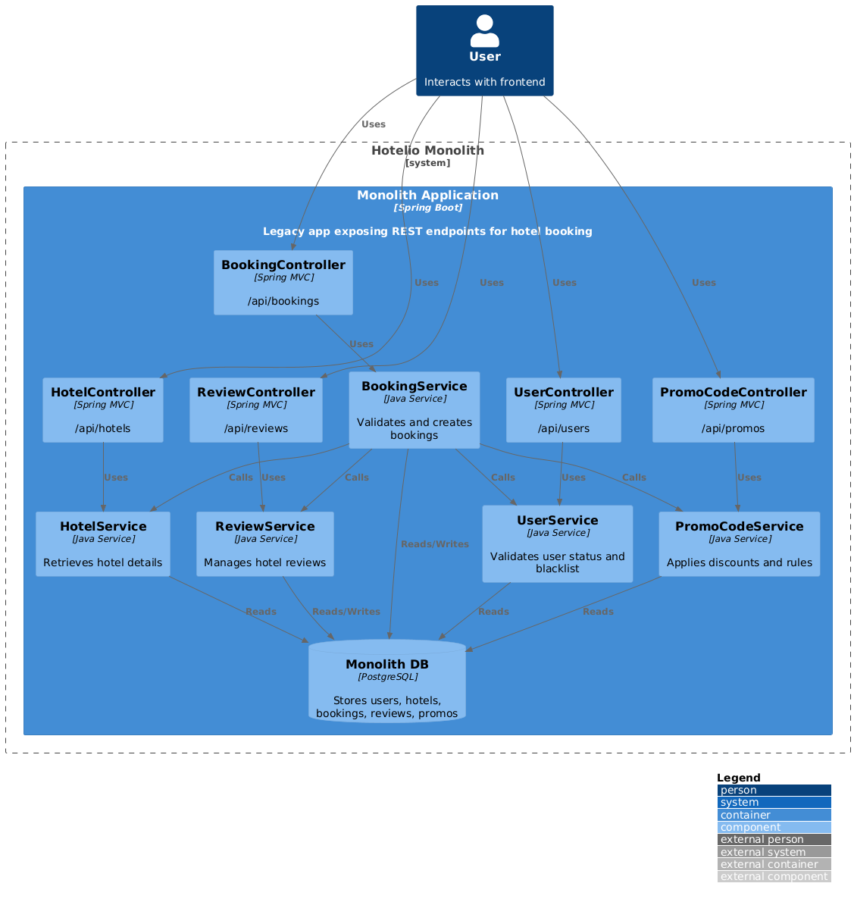
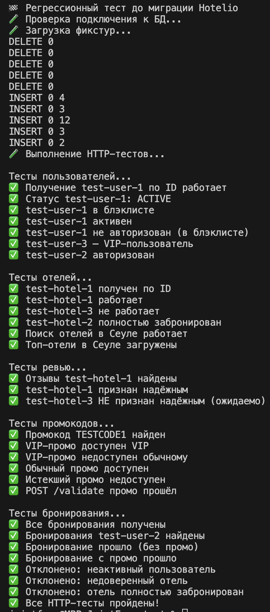
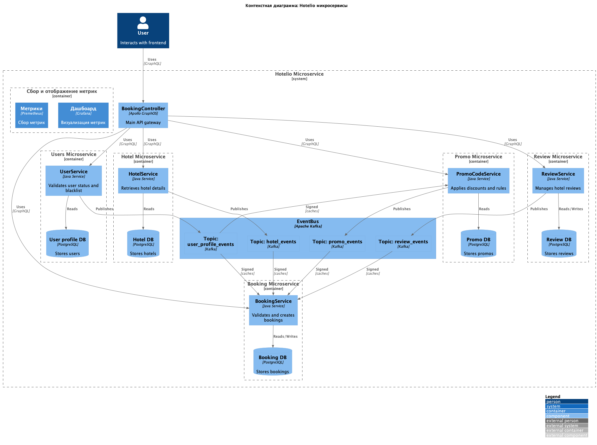

### **Название задачи:** ADR-1: Миграция hotelio на микросервисную архитектуру
### **Автор:** JointFuse
### **Дата:** 28.01.2026

# Контекст

Сервис Hotelio реализован как единое приложение, в котором все бизнес-функции собраны в одном коде, разворачиваются как единый сервис и используют одну базу данных.

## Текущие проблемы

1) Сложность сопровождения
 - Любое изменение требует понимания всей кодовой базы.
 - Невозможно менять один модуль, не затрагивая другие.
2) Низкая масштабируемость
 - При пиковых нагрузках (например, на бронирование) нельзя масштабировать только нужный компонент.
 - Производительность неравномерна.
3) Невозможность гибкой разработки
 - Разные команды не могут работать независимо.
 - Трудно внедрить быстрый CI/CD.
4) Ограничения на фронтенде
 - REST API монолита слишком универсален и плохо адаптируется под разные платформы.
 - Нет поддержки BFF.
5) Сложности с запуском новых фич
 - Большой риск ошибок из-за плотной связанности.
 - Тестирование требует понимания всех зависимостей.

Финальное целевое состояние через год:
- Полный переход на микросервисную архитектуру.
- Service mesh с автоматизированными rollouts.
- Масштабируемая Kafka-инфраструктура.
- Метрики и трассировка на каждый сервис.
- GraphQL для фронтенда.

### **Решение**

Микросервисная архитектура сервиса Hotelio прелставляет из себя набор изолированных контейнеров передающих информацию через общую шину данных, каждый контейнер содержит  программные модули монолита и собственную БД для кеширования и локального хранения. Шлюз API построенный на Apollo GraphOS поддерживает GraphQL в соответствии с требованиями миграции и также способен работать с REST API что позволит постепенно выводить устаревшие endpoint монолита из использования. Управление service mesh при помощи Kubernetes позволяет настроить автоматизацию rollout и масштабирование отдельных участков системы под меняющуюся нагрузку. Prometheus и Grafana отвечают за сбор и визуализацию метрик. Микросервисы содержат менее объемную кодовую базу которую проще тестировать и сопровождать. При параллельной разработке отдельных микросервисов возможен их независимый rollout.

**План миграции**

Каждый сервис при миграции получает трафик пользователей при помощи настройки правил роутинга в Istio, для проведения А/В тестов часть трафика продолжает идти в монолит. После подтверждения надежности и эффектнивности трафик полностью перенаправляется на микросервис. Как модуль имеющий наибольшую связанность, сервис бронирования выносится из монолита в последнуюю очередь.

1) Сервис отелей. Данный сервис предоставляет ключевую информацию и переносится в первую очередь
2) Сервис отзывов. Потенциально содержит наибольшее количество данных и играет важную роль при взаимодействии с клиентом
3) Сервис пользователей. Содержит sensitive data и используется не реже остальных но при своей работоспособности играет меньшую роль в создании прибыли
4) Сервис промо кодов. Вероятно служит инструментом привлечения новых клиентов для маркетинга и зависит от сервиса пользователей, поэтому переносится после него
5) Сервис бронирования. Зависит от всех остальных сервисов, имеет самую объемную кодовую базу и переносится в последнюю очередь

### **Альтернативы**

1) Использование монолитной БД: упрощает архитектуру. Не масштабируется, RPS ограниченно.
2) Разработка собственного шлюза API: позволяет полностью контролировать кодовую базу. Требуется время и ресурсы на разработку.
3) Миграция сервисов пользователей и промо кодов в первую очередь - может быть целесообразно в зависимости от стратегии и целей бизнеса.

**Недостатки, ограничения, риски**

Внедрение таких сложных инструментов как Kubernetes или Apollo GraphOS требует дополнительного времени на адаптацию команды.
