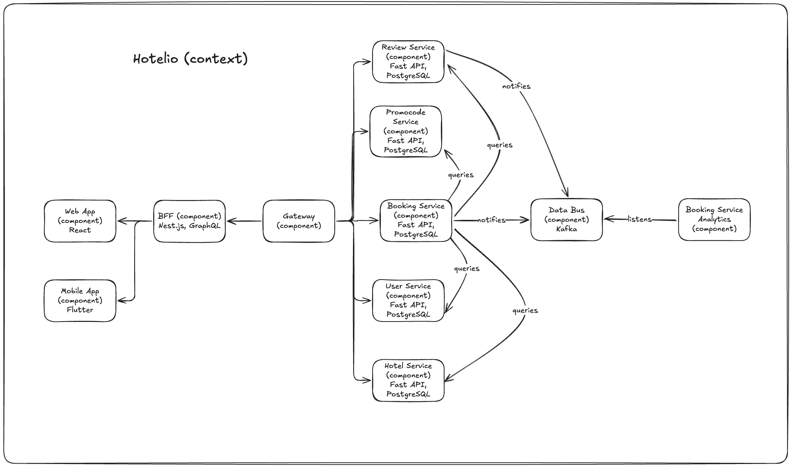

### **Название задачи: домашнее задание спринта 2** 
### **Автор: Вячеслав Москаленко**
### **Дата: 06.09.2025**
### **Функциональные требования**
Опишите здесь верхнеуровневые Use Cases. Их нужно оформить в виде таблицы с пошаговым описанием.

| **№** | **Действующие лица или системы** | **Use Case**               | **Описание**                                                                                            |
|:-----:|:---------------------------------|:---------------------------|:--------------------------------------------------------------------------------------------------------|
|   1   | Пользователь                     | Бронирует отель            | Активный пользователь бронирует отель в заданном городе на указанную дату                               |
|   2   | Пользователь                     | Оставляет отзыв            | Пользователь оставляет отзыв об отеле                                                                   |
|   3   | Пользователь                     | Просматривает бронирования | Пользователь видит свои бронирования                                                                    |
|   4   | Пользователь                     | Получает скидку            | Пользователь применяет промо-код при оформлении бронирования и получает скидку, если промо-код применим |
|   5   | Анти-фрод агент                  | Банит пользователя         | Анти-фрод система банит пользователя в случае обнаружения подозрительной активности                     |
### **Нефункциональные требования**
Опишите здесь нефункциональные требования и архитектурно значимые требования.

| **№** | **Требование**                                                         |
|:-----:|:-----------------------------------------------------------------------|
|   1   | Взаимодействие с точкой входа в систему по HTTP (REST API)             |
|   2   | Сервис должен предоставлять возможность анализа действий пользователей |
### **Решение**
У текущего монолита ряд проблем:
1. сложность сопровождения;
2. низкая масштабируемость;
3. невозможность гибкой разработки;
4. ограничения на фронтенде;
5. трудно расширять функционал системы;
6. сложности с переписыванием высоконагруженных частей на другом технологическом стеке;
7. единый веб-сервер на все приложение;

Предлагается вынести каждый из доменов в отдельный микросервис:
1. `BookingService` - отвечает за управление бронированием;
2. `UserSerivce` - отвечает за управление профилями пользователей;
3. `PromocodeService` - отвечает за управление скидками;
4. `HotelService` - отвечает за управление профилями отелей;
5. `ReviewService` - отвечает за управление отзывами пользователей об отелях;
6. `DataBus` - шина данных для коммуникации микро-сервисов:
  - принимает события:
    - о новой брони отеля;
    - на новый отзыв об отеле.
7. `Booking Service Analytics` - отвечает за подготовку аналитических отчетов;
8. `Gateway` - фасад над ландшафтом микро-сервисов системы. Поставляет данные для `BFF` или для внешних интеграторов;
9. `BFF` - прокси между `Gateway` и фронтендом ({веб,мобильное} приложение).

Предлагается начать с выноса функциональности бронирования из монолита в отдельный микросервис, потому что это основная артерия системы, которая приносит деньги.
Выделение ее в отдельный контур позволит отдельной команде быстрее расширять систему бронирования и оперативно готовиться к сезонным всплескам спроса.

Микросервисы предлагается реализовать на `FastAPI` (`Python` фрэймворк), так как:
* технология активно развивается;
* фрэймворк поддерживает современные стандарты;
* решение масштабируемо;
* популярно сейчас на рынке, что не создаст трудностей в найме инженеров.

`BFF` предлагается реализовать на `Nest.js`, так как:
* он архитектурно схож со `Spring`, что позволит его оперативно освоить инженерам, разработавшим монолит;
* `Node.js` имеет обширное множество пакетов-расширений (`npm`) и хорошо интегрируется с `GraphQL`;
* в будущем можно без труда поддержать `web sockets` для обновления `ui` в реальном времени.

### **Альтернативы**
Реализовать переход на микро-сервисы одномоментно (`big bang`).
Решение сопряжено с большим риском сбоев, что влечет репутационные и денежные потери.

Как следствие, предлагается решение с постепенной заменой модулей монолита на микро-сервисы, начиная с модуля бронирования.

**Недостатки, ограничения, риски**

Прямо вытекают из паттерна `Strangler fig `:
1. длительный процесс, в ходе которого система трансформируется постепенно. Проект может занять от полугодия до года;
2. необходимость одновременной поддержки монолита (обслуживание, исправление критичных багов) и развития новых микро-сервисов, что влияет на сроки и стоимость разработки;
3. необходимость в `anti-corruption layer` на период маршрутизации запросов от монолита к микро-сервисам и обратно. 