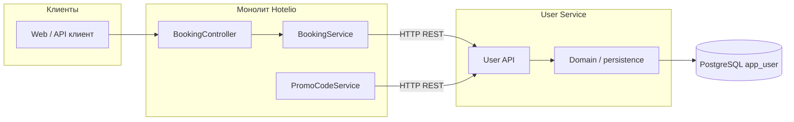

### **Название задачи:**

ADR-001: Выделение UserService из монолита Hotelio (паттерн Strangler Fig)

### **Автор:**

*Филипп Башир*

### **Дата:**

27.03.2026

### **Функциональные требования**

Верхнеуровневые сценарии использования домена «пользователь» и потребителей сервиса после выделения.

| **№** | **Действующие лица или системы**                                 | **Use Case**                        | **Описание**                                                                                                                                                              |
| ----- | ---------------------------------------------------------------- | ----------------------------------- | ------------------------------------------------------------------------------------------------------------------------------------------------------------------------- |
| UC-1  | Клиент (фронтенд / внешний потребитель), User Service            | Получить профиль пользователя       | По `userId` вернуть данные пользователя (идентификатор, статус, признаки active/blacklisted, контактные поля при необходимости). Соответствует `GET /api/users/{userId}`. |
| UC-2  | Booking Service (монолит → затем отдельный сервис), User Service | Проверить допуск к бронированию     | Перед созданием брони убедиться, что пользователь активен и не в чёрном списке. При нарушении — отказ с понятной ошибкой.                                                 |
| UC-3  | Booking Service, User Service                                    | Получить статус для ценообразования | Вернуть строковый статус (например, `VIP`) для расчёта базовой цены бронирования.                                                                                         |
| UC-4  | PromoCode Service (в монолите), User Service                     | Учесть VIP при валидации промокода  | Определить, является ли пользователь VIP, чтобы применить правила промокода (`vipOnly`).                                                                                  |
| UC-5  | Клиент, User Service                                             | Быстрые проверки атрибутов          | Отдельные эндпоинты: активен ли пользователь, в чёрном списке, «авторизован» (active ∧ ¬blacklisted), VIP — для UI и интеграций.                                          |

*Текущая реализация в монолите:* `AppUserService` + `AppUserController`, таблица `app_user`. Зависимости: `BookingService`, `PromoCodeService` вызывают методы пользовательского сервиса внутри процесса.

### **Нефункциональные требования**

| **№** | **Требование**                                                                                                                                                                                                                             |
| ----- | ------------------------------------------------------------------------------------------------------------------------------------------------------------------------------------------------------------------------------------------ |
| NFR-1 | **Доступность:** User Service — критичный для создания бронирований; целевой SLA не хуже монолита на этапе миграции (например, 99.5%+), проектирование с health-checks и рестартами.                                                       |
| NFR-2 | **Задержка:** синхронные вызовы из монолита (HTTP/gRPC) не должны заметно деградировать p95 времени `POST /api/bookings`; бюджет — порядка десятков мс на сеть + обработку (кэш при необходимости).                                        |
| NFR-3 | **Согласованность:** на переходном этапе допустима сильная согласованность чтения своих записей (один источник правды по `app_user`); при разделении БД — явная стратегия миграции данных и отсутствие расхождений для критичных проверок. |
| NFR-4 | **Безопасность:** аутентификация сервис-к-сервису (mTLS или токены), в перспективе — единая политика с service mesh; не логировать персональные данные в открытом виде.                                                                    |
| NFR-5 | **Наблюдаемость:** метрики (RPS, ошибки, латентность), структурированные логи с `correlationId`, трассировка (OpenTelemetry) в линии целевого состояния из задания.                                                                        |
| NFR-6 | **Эволюция:** контракт API версионируется; монолит ходит в User Service через абстракцию (клиент/фасад), чтобы сменить транспорт без переписывания бизнес-логики.                                                                          |

### **Решение**

#### Почему первым выносим именно UserService

- **Узкая предметная область** и одна основная таблица (`app_user`) — проще границы контекста и миграция данных.
- **Стабильный контракт:** потребителям нужны проверки active/blacklisted, статус и VIP — это небольшой набор операций, удобно оформить как REST (уже отражено в публичном API монолита).
- **Высокая востребованность:** `BookingService` и `PromoCodeService` зависят от пользователя; вынос отрабатывает реальный сетевой вызов и готовит инфраструктуру (деплой, мониторинг, контракты) для следующих сервисов.
- **Меньше риска, чем вынос Booking:** бронирование оркестрирует отель, отзывы, промо и пользователя; первый шаг через пользователя снижает сложность отката.

#### Целевая картина (C4 — уровень контекста, упрощённо)

Система Hotelio взаимодействует с пользователем через веб-клиент; оркестрация бронирования пока остаётся в монолите, но обращение к данным пользователя идёт в выделенный сервис.

**Участники:** пользователь → монолит (публичный API); монолит (`BookingService`, `PromoCodeService`) → **User Service** (внутренний REST); User Service → PostgreSQL (`app_user`).

#### C4 — уровень контейнеров (целевое состояние шага миграции)

| Контейнер            | Технология (предложение)                  | Ответственность                                                                                                       |
| -------------------- | ----------------------------------------- | --------------------------------------------------------------------------------------------------------------------- |
| **user-service**     | Spring Boot 3.x, Java 17 (как в монолите) | Реализация UC-1–UC-5, собственный деплой и масштабирование.                                                           |
| **БД пользователей** | PostgreSQL                                | Хранение `app_user`; на переходном этапе возможен общий инстанс с отдельной схемой/БД или полное перенесение таблицы. |
| **Монолит**          | Существующий JAR                          | `BookingService` / `PromoCodeService` вызывают **User Service Client** (HTTP) вместо прямого `AppUserService`.        |

#### Логика выбора технологий

- **Spring Boot + REST** — совпадение со стеком монолита, быстрый перенос кода репозитория/сущности, знакомая команда.
- **PostgreSQL** — без смены СУБД; упрощает перенос схемы и инструментов.
- **Синхронный REST на первом этапе** — проще отладка, чем Kafka для обязательных проверок в пути запроса бронирования; событийная модель (outbox) — опционально позже для аналитики и инвалидации кэшей.

#### План миграции (Strangler Fig)

1. **Подготовка:** зафиксировать контракт OpenAPI для User Service (эндпоинты, совместимые с текущим `/api/users/...` или внутренней версией `/internal/users/...`).
2. **Сервис:** поднять `user-service` с копией логики `AppUserService` + доступ к `app_user` (сначала та же БД/реплика чтения — по решению команды; минимальный риск — отдельная схема с миграцией).
3. **Фасад в монолите:** ввести интерфейс `UserClient` с реализациями `InProcessUserClient` (текущий код) и `RemoteUserClient` (HTTP).
4. **Переключение:** feature flag / процент трафика: бронирование и валидация промо ходят в удалённый сервис; мониторинг ошибок и латентности.
5. **Вырезание:** удалить прямую зависимость `AppUserService` из `BookingService` и `PromoCodeService`; публичные `GET /api/users/`* проксировать в User Service или отдать маршрутизацию API-шлюзу.
6. **Следующие шаги:** в линии целевого состояния — service mesh, Kafka для событий жизненного цикла пользователя, метрики и трассировка на каждый сервис.

### **Альтернативы**

| Альтернатива                                   | Суть                                     | Почему не выбрана как первый шаг                                                                                                         |
| ---------------------------------------------- | ---------------------------------------- | ---------------------------------------------------------------------------------------------------------------------------------------- |
| **A1. Сначала вынести BookingService**         | Сразу разбить «ядро» бронирований        | Максимум зависимостей и сценариев отказа; сложнее откат и тестирование.                                                                  |
| **A2. Сначала HotelService или ReviewService** | Меньше критичности для оплаты/блокировок | Не снимает узкое место общих проверок пользователя для каждого бронирования; меньше эффекта для единого контракта «допуск пользователя». |
| **A3. Общая БД без выделенного сервиса**       | Только модульные границы в коде          | Не даёт независимого деплоя и масштабирования, слабее соответствует цели микросервисной трансформации.                                   |
| **A4. gRPC вместо REST**                       | Бинарный контракт, меньше оверхеда       | Увеличивает порог входа и инфраструктуру на первом шаге; возможна эволюция после стабилизации REST.                                      |

**Недостатки, ограничения, риски**

- **Сетевые сбои:** монолит зависит от доступности User Service — нужны таймауты, retry с осторожностью (идемпотентность на стороне бронирования), circuit breaker (Resilience4j и аналоги).
- **Распределённые транзакции:** нет единой БД-транзакции между бронированием и чтением пользователя; границы согласованности должны быть явно задокументированы (saga/компенсации при необходимости на следующих этапах).
- **Дублирование схемы/данных:** при временном dual-read возможны гонки; нужен чёткий план единственного источника правды и миграции.
- **Операционные затраты:** ещё один сервис для деплоя, логирования, алертов — до появления mesh и унифицированной платформы.
- **Безопасность внутренних вызовов:** без mTLS/сервисных аккаунтов — риск несанкционированного доступа к internal API; закрыть сеть (private) и секреты.

