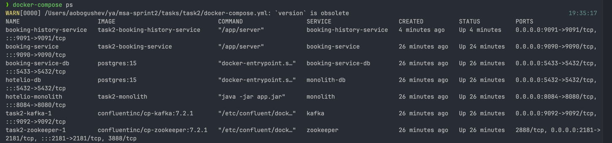
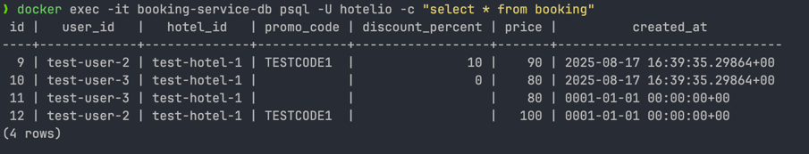
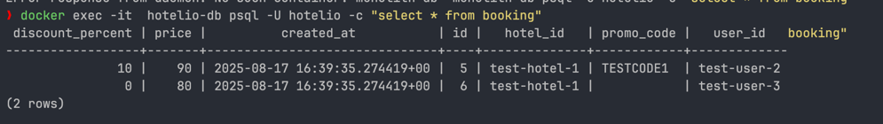
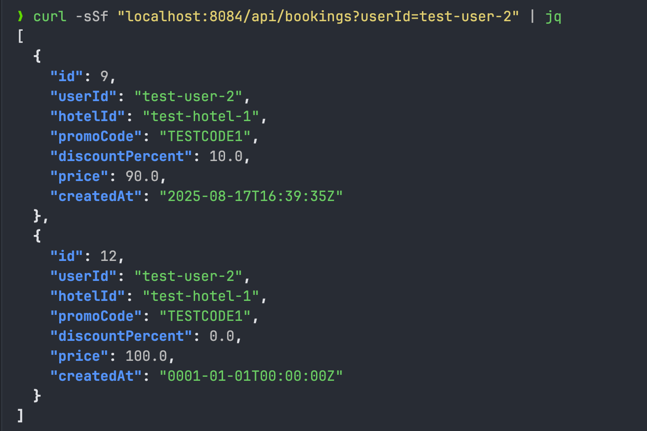
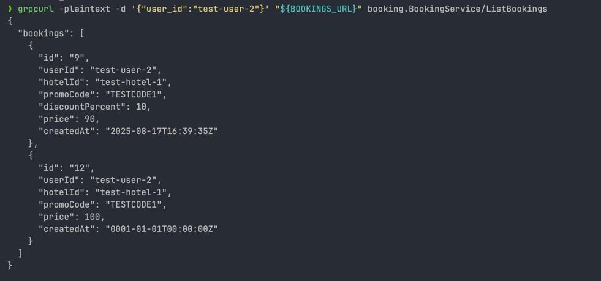

task2/results/
- Лог/скриншот `docker ps` 
  - 
- Доработанный regress.sh (мб. init-fixtures) 
  - переработанные тесты в [test](../test)
  - фикстуры для бд booking-service в [init-fixtures-bookings-service.sql](../test/init-fixtures-bookings-service.sql)

- test-log.txt (проведение тестовых запросов) 
  - в файле [test-log.txt](test-log.txt)

- select * from bookings из новой системы и старой в текстовом виде после выполнения тестов
  - booking_service_select 
  - monolith_db_select 

- README.md с объяснением стратегии миграции данных при запуске нового сервиса и стратегии To Be
  - из описания в adr.md этап 2:
    - заводим отдельную бд для микросервиса
    - начинаем сохранять бронирования в новую бд
    - механизм получения списка бронирований /api/bookings меняем так чтобы делал поиск и по новой бд и по старой + мерж результатов
    - фоном копируем бронирования из старой бд в новую, после чего список бронирований отдает только из новой бд.

- листинг бронирований, вызванный через REST из монолита и GRPC из микросервиса
    - monolith 
    - booking_service_list 

- select * из таблицы с историческими данными о бронированиях
  - из booking-history-service ? делать 2ю такую же таблицу как  booking-service ? зачем эта копипаста?