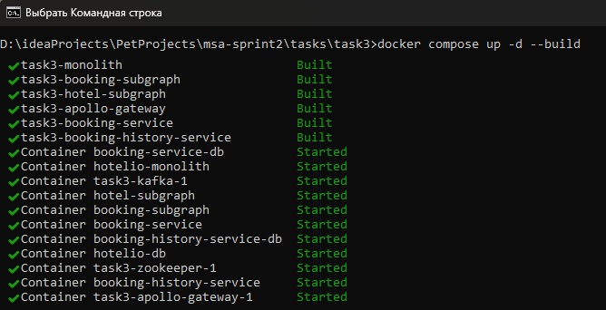
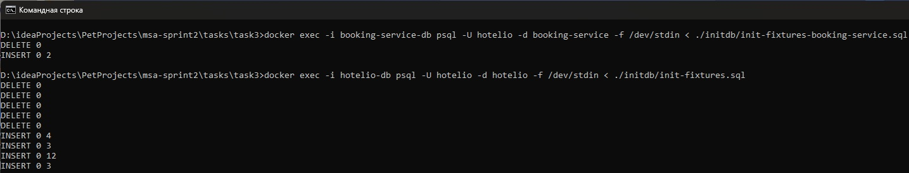
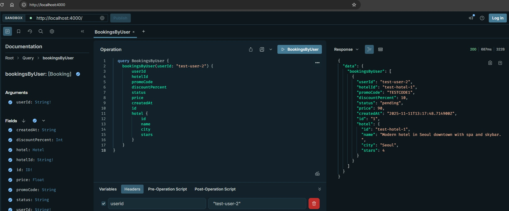
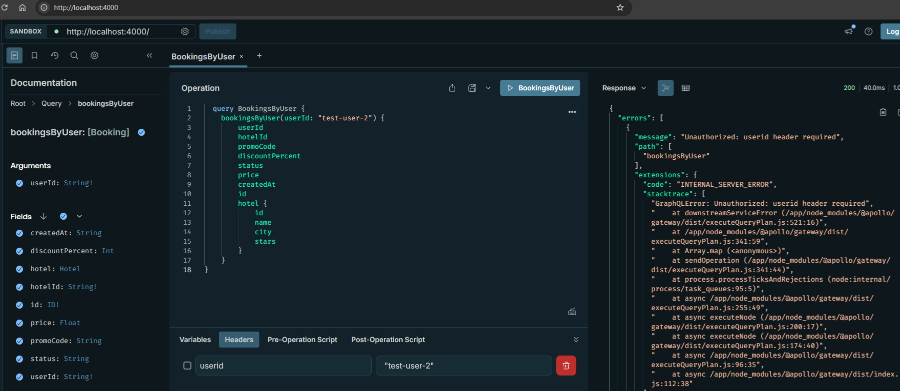
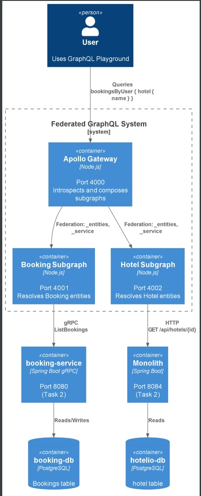

### **Название задачи: Федеративный GraphQL API**

### **Автор: Алексей Тимофеев**

### **Дата: 14.11.2025**

## Обзор

Это решение реализует федеративный GraphQL API поверх микросервисов, разработанных в Task 2, с использованием Apollo Federation.

**Компоненты:**

*   **Gateway (порт 4000):** Основной точкой входа для клиентских запросов. Автоматически агрегирует GraphQL-схемы из подключенных subgraph'ов.
*   **Booking-subgraph (порт 4001):**
  *   Отвечает за сущность `Booking`.
  *   Выполняет gRPC-вызов к `booking-service` для получения данных.
  *   Реализует проверку контроля доступа (ACL) на уровне резолверов, используя заголовок `userid`.
*   **Hotel-subgraph (порт 4002):**
  *   Отвечает за сущность `Hotel`.
  *   Выполняет REST-запрос к `monolith` для получения данных.
  *   Осуществляет маппинг полей из ответа монолита в поля GraphQL-схемы (например, `description` в `name`, `rating` в `stars`).

**Интеграция:**

*   Subgraph'ы размещены в Docker-сети `hotelio-net`, созданной в Task 2.
*   Установлены зависимости (`depends_on`) от `booking-service` и `monolith`.
*   Заголовки HTTP, включая `userid` (используемый для ACL), автоматически передаются от Gateway к соответствующим subgraph'ам и downstream-сервисам.

## Установка и запуск

Перейдите в директорию task3:

```bash
cd tasks/task3
```

Соберите образы:

```bash
docker compose up -d --build
```



##  Подготовка тестовых данных

В booking-db (Bookings)
```bash
docker exec -i booking-service-db psql -U hotelio -d booking-service -f /dev/stdin < ./initdb/init-fixtures-booking-service.sql
```

В hotelio-db (hotel)

```bash
docker exec -i hotelio-db psql -U hotelio -d hotelio -f /dev/stdin < ./initdb/init-fixtures.sql
```



## Тестирование
### GraphQL Playground
- Откройте: [http://localhost:4000](http://localhost:4000).
  - **Query** (федерация: booking + hotel):
    ```
    query BookingsByUser {
      bookingsByUser(userId: "test-user-2") {
          userId
          hotelId
          promoCode
          discountPercent
          status
          price
          createdAt
          id
          hotel {
              id
              name
              city
              stars
          }
      }
    }
    ```
  - **HTTP Headers** (вкладка слева):
    ```
    {userid: "test-user-2"}
    ```
  - **Ожидаемый ответ**:
    ```
    {
      "data": {
        "bookingsByUser": [
          {
            "userId": "test-user-2",
            "hotelId": "test-hotel-1",
            "promoCode": "TESTCODE1",
            "discountPercent": 10,
            "status": "pending",
            "price": 90,
            "createdAt": "2025-11-11T13:17:48.714900Z",
            "id": "1",
            "hotel": {
              "id": "test-hotel-1",
              "name": "Modern hotel in Seoul downtown with spa and skybar.",
              "city": "Seoul",
              "stars": 4
            }
          }
        ]
      }
    }
    ```



### Тест ACL (Deny)
- **Query**: Тот же.
- **Headers**: Пустой или `{"userid": "wrong"}`.
- **Ожидаемый ответ**:
  ```
  {
    "errors": [
      {
        "message": "Unauthorized: userid header required"
      }
    ]
  }
  ```



## Описание изменений и решений

### Реализация

*   **Gateway (порт 4000):**
  *   Используется Apollo Gateway.
  *   Применена стратегия `IntrospectAndCompose` для автоматического обнаружения схем subgraph'ов (подходит для Apollo Federation v2, заменяет устаревший `serviceList`).
*   **Booking-subgraph (порт 4001):**
  *   Реализует сущность `Booking` (с `@key(id)`).
  *   Resolver `bookingsByUser` выполняет gRPC-вызов (`ListBookings`) к `booking-service`.
  *   Federation-resolver `hotel` выполняет GraphQL-запрос к `hotel-subgraph`, используя `hotelId`.
  *   **ACL:** Проверяет, совпадает ли `req.headers['userid']` с запрашиваемым `userId`. Выбрасывает ошибки "Unauthorized"/"Forbidden" при несоответствии.
*   **Hotel-subgraph (порт 4002):**
  *   Реализует сущность `Hotel` (с `@key(id)`).
  *   Resolver `hotelsByIds` выполняет REST-запрос к `monolith` (`/api/hotels/{id}`).
  *   **Маппинг данных:** Поле `description` из монолита маппится в `name` в GraphQL-схеме, `rating` — в `stars`. При `null` значениях используются fallback-значения ('Unknown' для `name`, 0 для `stars`).
*   **Интеграция с Task 2:**
  *   Subgraph'ы размещены в Docker-сети `hotelio-net`.
  *   Установлены зависимости (`depends_on`):
    *   `booking-subgraph` зависит от `booking-service`.
    *   `hotel-subgraph` зависит от `monolith`.
  *   gRPC- и REST-вызовы между компонентами корректно настроены для взаимодействия внутри сети.
  *   Заголовки, включая `userid` (для ACL), передаются через Gateway и автоматически пробрасываются в соответствующие subgraph'ы и downstream-сервисы.

### Принятые решения

*   **Federation и стичинг схем:**
  *   Использована Apollo Federation для объединения логически разделённых схем (`booking` и `hotel`).
  *   Связь между `Booking` и `Hotel` реализована через `@key(id)` и federation-resolver в `booking-subgraph`.
*   **Контроль доступа (ACL):**
  *   Проверка подлинности и авторизации реализована на уровне resolver'ов в `booking-subgraph` с использованием заголовка `userid`.
  *   В случае отсутствия заголовка или несоответствия идентификатора, выбрасываются ошибки.
*   **Обработка ошибок:**
  *   В resolver'ах обрабатываются потенциальные ошибки от gRPC- (`booking-service`) и REST-сервисов (`monolith`).
  *   Реализованы fallback-механизмы (например, возврат `null` для `hotel`, если он не найден в монолите).
*   **Прототипирование:**
  *   Некоторые resolver'ы могут содержать заглушки для упрощения тестирования (например, mock-данные). В продакшн-версии они должны быть заменены полнофункциональными вызовами.

