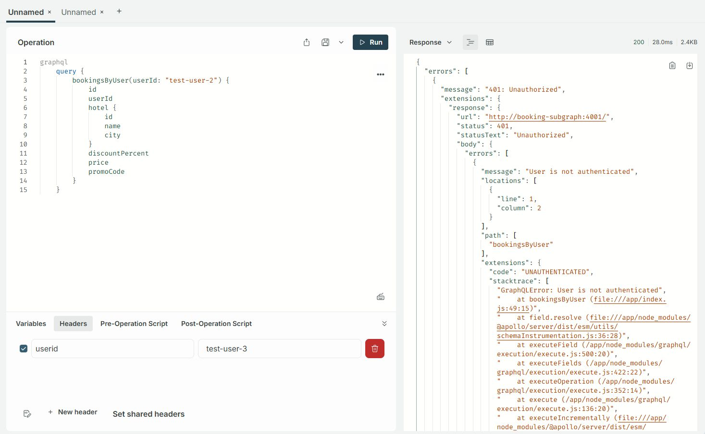
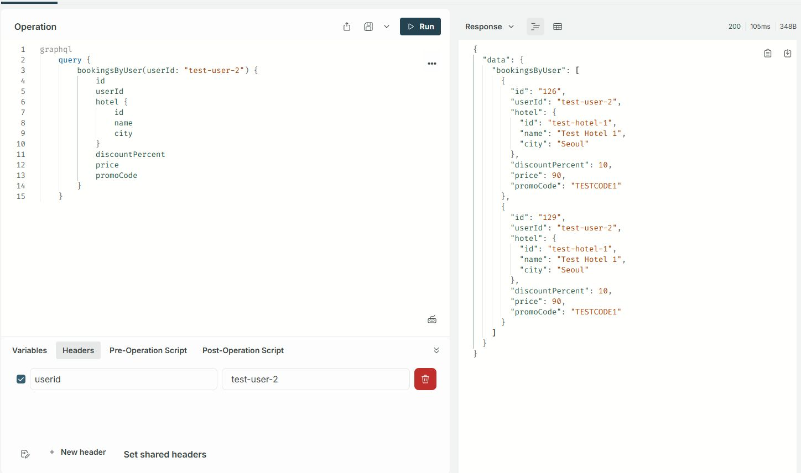
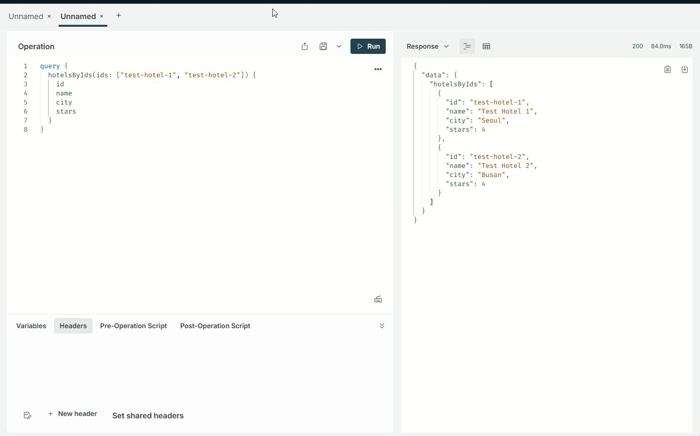
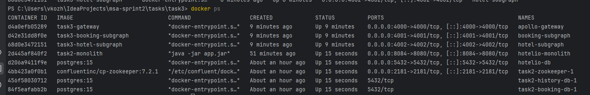

## 1. Gateway

1. Была доработана авторизация и прокидывание userId в заголовки дочерних сервисов, был реализован `AuthenticatedDataSource`
2. Добавление чтение конфигурации дочерних сервисов через переменные окружения

## 2. Booking-Subgraph

1. Реализован `bookingService.js` для отправки запросов на gRPC сервис
2. Реализована авторизация и метод получения списка бронирований
3. Добавлено объявление общего типа `Hotel` для возможности получения описания Отеля

## 3. Hotel-Subgraph

1. Реализован `hotelService.js` для отправки запросов на монолитный API для получения информации об отеле
2. Реализован метод получения списка отелей по идентификаторам
3. Реализован метод резолвинга сущности отеля из других графов

## 4. Прочее

1. Доработаны локальные настройки проектов для удобного запуска и отладки
2. Доработан docker-compose с указанием необходимой конфигурации и подключение в общую сеть `hotelio-net`

## 5. Скриншоты ответов:

## 6. Докер пс:
