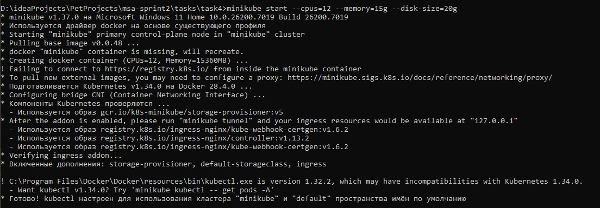
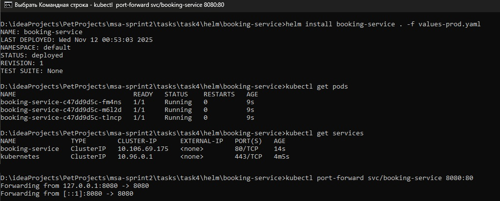
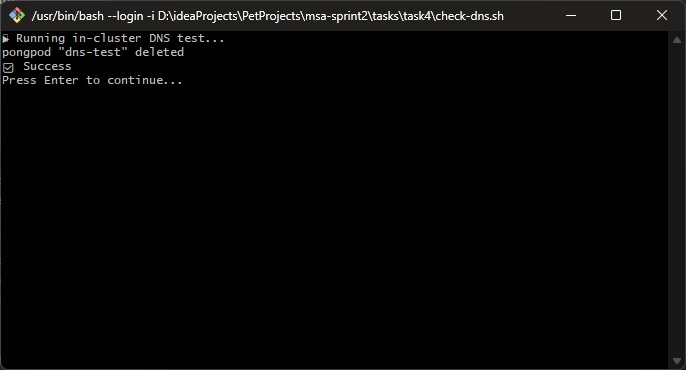
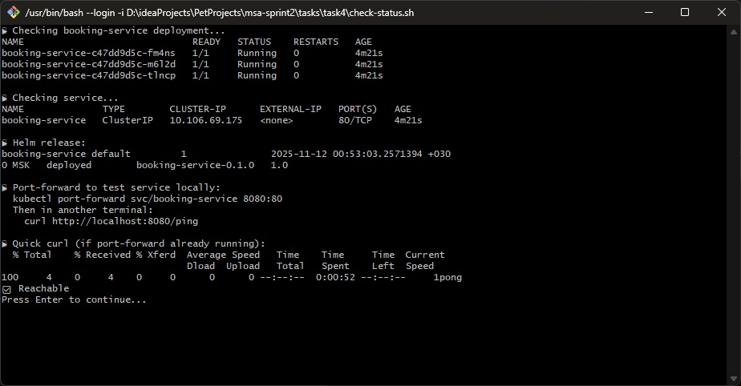
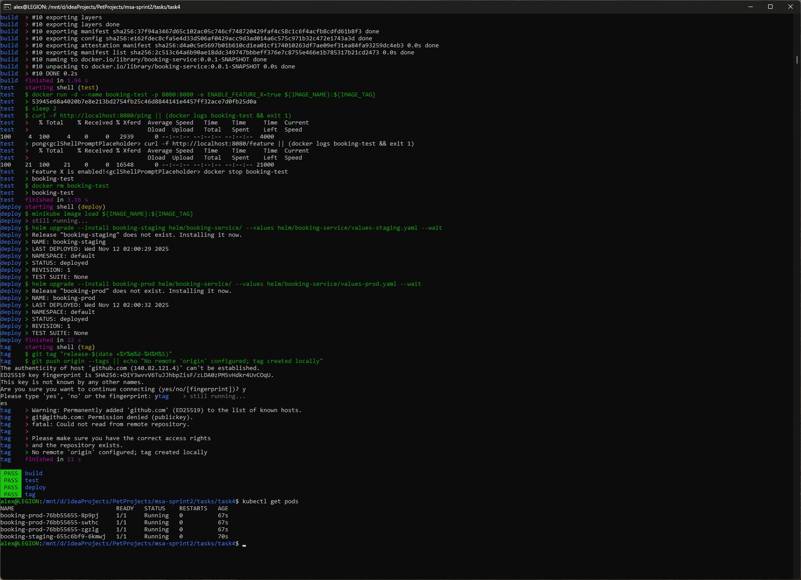

### **CI/CD для booking-service с Helm и Minikube**

### **Автор: Алексей Тимофеев**

### **Дата: 14.11.2025**

## Реализация

- **booking-service**: Go-сервис на порту 8080 (/ping → "pong", /feature если `ENABLE_FEATURE_X=true`).
- **Helm-чарт**: Deployment (liveness/readiness probes на /ping, env для flag, resources requests/limits), Service (ClusterIP, порт 80 → 8080).
    - [values-staging.yaml](helm/booking-service/values-staging.yaml): 1 реплика, низкие ресурсы `ENABLE_FEATURE_X=false`.
    - [values-prod.yaml](helm/booking-service/values-prod.yaml): 3 реплики, высокие ресурсы, `ENABLE_FEATURE_X=true`.
- **CI/CD** (.gitlab-ci.yml): Стадии build (Docker), test (run container + curl /ping+/feature), deploy (Minikube image load + Helm upgrade staging/prod), tag (git tag с timestamp).
    - Локальная симуляция: `gitlab-ci-local` ([скриншот](results/cicd.jpg)).
- **Проверки**:
    - [check-dns.sh](check-dns.sh): In-cluster curl `http://booking-staging:8080/ping` → "✅ Success".
    - [check-status.sh](check-status.sh): kubectl get pods/svc + Helm list.
- **Makefile**: Targets для ci (gitlab-ci-local), build, deploy, test-dns/status.

## Установка и запуск

Запустите Minikube:

```bash
minikube start
```

Соберите Docker-образ и загрузите его в Minikube:

```bash
cd task4/

docker build -t booking-service:0.0.1-SNAPSHOT ./booking-service

minikube image load booking-service:0.0.1-SNAPSHOT
```



Установите Helm-чарт и настройте проброс порта:

```bash
helm install booking-service . -f values-prod.yaml

kubectl port-forward svc/booking-service 8080:80
```



Выполните проверочные тесты:

```bash
./check-dns.sh

./check-status.sh
```





Для запуска CI/CD конвейера выполните:

```bash
gitlab-ci-local build test deploy tag
```

