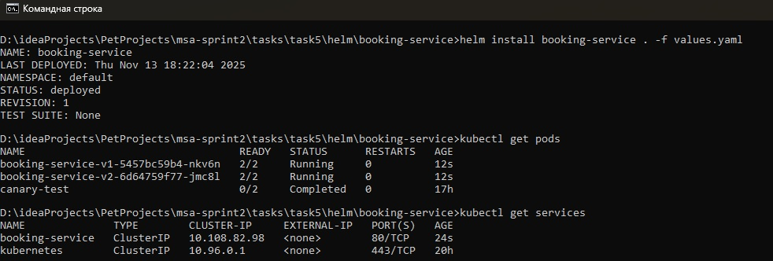
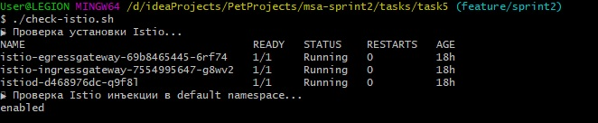
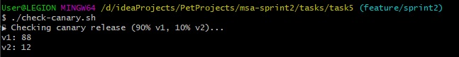
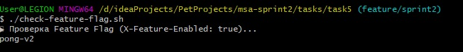
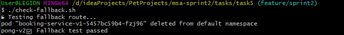

### **Istio Traffic Management in Minikube**


### **Автор: Алексей Тимофеев**

### **Дата: 14.11.2025**

## Реализация

Настроить в кластере Kubernetes управление трафиком для микросервиса booking-service с использованием Istio Service Mesh:

- Canary-релиз: 90% трафика на v1, 10% на v2
- Маршрутизация по фича-флагу: при X-Feature-Enabled: true → v2
- Fallback при отказе v1
- Настроить Retry и Circuit Breaking

## Описание изменений

### 1. Подготовка окружения
   - Установлен Istio: istioctl install --set profile=demo
   - Включен auto-injection sidecar в namespace default:
   ```bash
   kubectl label namespace default istio-injection=enabled --overwrite
   ```   
   - Деплой booking-service в двух версиях через Helm
     v1: ENABLE_FEATURE_X=false, отвечает "pong-v1"
     v2: ENABLE_FEATURE_X=true, отвечает "pong-v2"

   - Каждый под имеет label version: v1 или version: v2 для Istio-подмножеств.

### 2. Конфигурация Istio

#### `DestinationRule`
Файл [`virtual-service.yaml`](virtual-service.yaml), реализующий:
- Подмножества v1 и v2 по label version
- Параметры соединений: maxConnections: 100, http1MaxPendingRequests: 10
- Outlier detection:
  - Исключение после 3 последовательных 5xx
  - Интервал: 10 секунд, время исключения: 30 секунд

#### `VirtualService`
Файл [`virtual-service.yaml`](virtual-service.yaml), реализующий:
- **Feature-flag маршрутизацию**:  
  При X-Feature-Enabled: true → трафик на subset: v2
- **Canary-релиз**:  
  90% трафика на v1, 10% на v2 по умолчанию

> **Важно**: `EnvoyFilter` **не использовался**, так как все требования покрываются стандартными возможностями `VirtualService`.


## Установка и запуск

Запустите Minikube:

```bash
minikube start
```

Соберите Docker-образ и загрузите его в Minikube:

```bash
cd task4/

docker build -t booking-service:0.0.1-SNAPSHOT ./booking-service

minikube image load booking-service:0.0.1-SNAPSHOT
```

Установите Helm-чарт:

```bash
helm install booking-service . -f values.yaml
```



Откройте туннель.

```bash
minikube tunnel
 ```

Выполните проверочные тесты:

```bash
./check-istio.sh
```



```bash
./check-canary.sh
```



```bash
./check-feature-flag.sh
```



```bash
./check-fallback.sh
```

